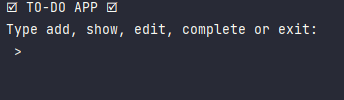

# todo-list-app

(Start: 4th June 2023)

In this app, the user will be able to add or remove items from a To-Do list as their choice.
This App will have 3 versions:
1. Command line interface
2. Desktop interface
3. Website interface

The App have five main functionalities:
- add (receives user input): adds a single item to the list;
- show: shows every item of the list;
- edit (receives user input): edits a single item from the list;
- complete (receives user input): risks off a item from the list;
- exit: finish the program.
## 1. Command line interface
### 1.1. [🏆] Alpha 1.2v!
_Release: 07/05/2023 (5th July 2023)_

This is the first usable and fully optimized version of the Todo List App. The five concepts (add, show, edit, complete, exit) can be executed simply through the command line.

#### Demonstration:

If the user types "add", the program will ask for the to-do:

Then the user can type "show" to see the enumerated list of to-dos:

If the user wants to edit a to-do, they should type "edit", then the app will ask for the number that corresponds to the to-do. After that, it will ask for the new to-do and replace it:

If the user wants to mark a to-do as complete, they should type "complete" and give the number that corresponds to the to-do (similar to "edit"):

Finally, if the user wants to exit the app, they should type "exit":

